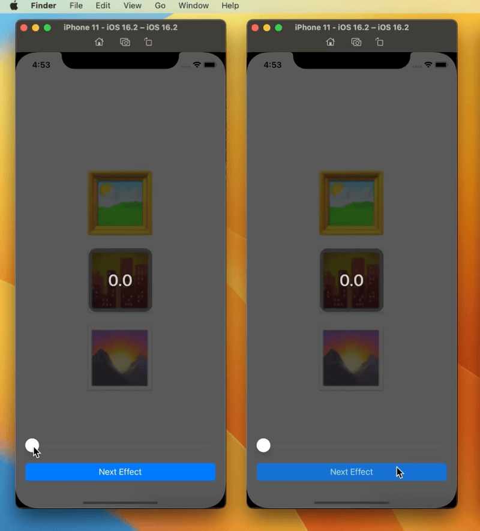

# VisualEffectBlurView

[](https://swiftpackageindex.com/dominicstop/VisualEffectBlurView) [](https://swiftpackageindex.com/dominicstop/VisualEffectBlurView)

A subclass of `UIVisualEffectView` that lets you set a custom blur radius + intensity, or set `CALayer.filter` using `CAFilter` (which is obfuscated since it's private API). 

Animation is supported for changing the blur radius (or blur percent intensity) for a given `UIBlurEffect.Style`, and also for custom effects via `CAFilter` (please see gif below for demo).

* Support for animatable `CAColorMatrix` (i.e. `colorMatrix` filter). configurable via [`ColorTransform`](Sources/Common/ColorTransform.swift) or [`ColorMatrixRGBA`](Sources/Common/ColorMatrixRGBA.swift).
* Support for `variableBlur`, w/ animatable blur radius.
* Other animatable filters: `colorMonochrome`, `colorSaturate`, `colorBrightness`, `colorContrast`, `colorHueRotate`, `compressLuminance`, `gaussianBlur`, `luminanceCurveMap`, `vibrantDark`, `vibrantLight`, etc (see [`LayerFilterType`](Sources/ObjectWrappers/LayerFilterWrapper/LayerFilterType.swift) for full list of filters).

<br><br>

## Demo Gifs

[`Experiment02ViewController.swift`](./example/Routes/Experiment02ViewController.swift)


<br>

[`VisualEffectBlurTestViewController.swift`](./example/Routes/VisualEffectBlurTestViewController.swift)



<br>

[`VisualEffectViewExperiment01ViewController.swift`](./example/Routes/VisualEffectViewExperiment01ViewController.swift)


<br>

[`RNIVisualEffectCustomFilterViewTest01Screen.tsx`](https://github.com/dominicstop/react-native-ios-visual-effect-view/blob/main/example/src/examples/RNIVisualEffectCustomFilterViewTest01Screen.tsx)


<br><br>

## Acknowledgements

very special thanks to: [junzhengca](https://github.com/junzhengca), [brentvatne](https://github.com/brentvatne), [expo](https://github.com/expo), [EvanBacon](https://github.com/EvanBacon), [corasan](https://github.com/corasan), [lauridskern](https://github.com/lauridskern), [ronintechnologies](https://github.com/ronintechnologies), and [gerzonc](https://github.com/gerzonc) for becoming a monthly sponsor, and thank you [fobos531](https://github.com/fobos531) for being a one time sponsor 🥺 (if you have the means to do so, please considering sponsoring [here](https://github.com/sponsors/dominicstop))

This little library powers [`react-native-ios-visual-effect-view`](https://github.com/dominicstop/react-native-ios-visual-effect-view) under the hood ✨

<br><br>

## Installation

### Cocoapods

`VisualEffectBlurView` is available through [CocoaPods](https://cocoapods.org). To install it, simply add the following line to your `Podfile`:

```ruby
pod 'VisualEffectBlurView'
```

<br>

### Swift Package Manager (SPM)

**Method #1**: Via Xcode GUI:

1. File > Swift Packages > Add Package Dependency
2. Add `https://github.com/dominicstop/VisualEffectBlurView.git`

<br>

**Method #2**: Via `Package.swift`:

* Open your project's `Package.swift` file.
* Update `dependencies` in `Package.swift`, and add the following:

```swift
dependencies: [
  .package(url: "https://github.com/dominicstop/VisualEffectBlurView.git",
  .upToNextMajor(from: "1.0.0"))
]
```

<br><br>

## Basic Usage

### UIKit

[🔗 Full Example](./example/Examples/BasicUsage01.swift)

```swift
// ✨ Code omitted for brevity

import UIKit
import VisualEffectBlurView;

class BasicUsage01: UIViewController {

  override func viewDidLoad() {
  	
    let blurView = VisualEffectBlurView(blurEffectStyle: .dark);
    blurView.blurRadius = 15;

    blurView.translatesAutoresizingMaskIntoConstraints = false;
    self.view.addSubview(blurView);
    
    NSLayoutConstraint.activate([
      blurView.topAnchor.constraint(
        equalTo: self.view.topAnchor
      ),
      blurView.bottomAnchor.constraint(
        equalTo: self.view.bottomAnchor
      ),
      blurView.leadingAnchor.constraint(
        equalTo: self.view.leadingAnchor
      ),
      blurView.trailingAnchor.constraint(
        equalTo: self.view.trailingAnchor
      ),
    ]);
  };
};

```

<br><br>

### SwiftUI

[🔗 Full Example](./example/Examples/VisualEffectBlurTestViewController.swift)

```swift
import SwiftUI
import VisualEffectBlurView

struct SwiftUIBasicUsage01: View {

  var body: some View {
    Text("🖼️\n🌆\n🌄")
      .font(.system(size: 128))
      .frame(
        maxWidth: .infinity,
        maxHeight: .infinity
      )
      .overlay(self.overlay, alignment: .center)
  }
  
  var overlay: some View {
    VisualEffectBlur(
      blurEffectStyle: .constant(.regular),
      blurRadius: .constant(nil)
    )
  };
}
```


## Documentation

The documentation for this library is currently not available. In the meantime, please browse through the [views](Sources/Views), and [examples](./example/Routes) directory (or look through the [impl. of RN wrapper](https://github.com/dominicstop/react-native-ios-visual-effect-view/blob/main/ios/RNIBlurView/RNIBlurViewDelegate.swift) for this library).

<br><br>

## Misc and Contact

* 🐤 **Twitter/X**: `@GoDominic`
* 💌 **Email**: `dominicgo@dominicgo.dev`
* 🌐 **Website**: [dominicgo.dev](https://dominicgo.dev)
